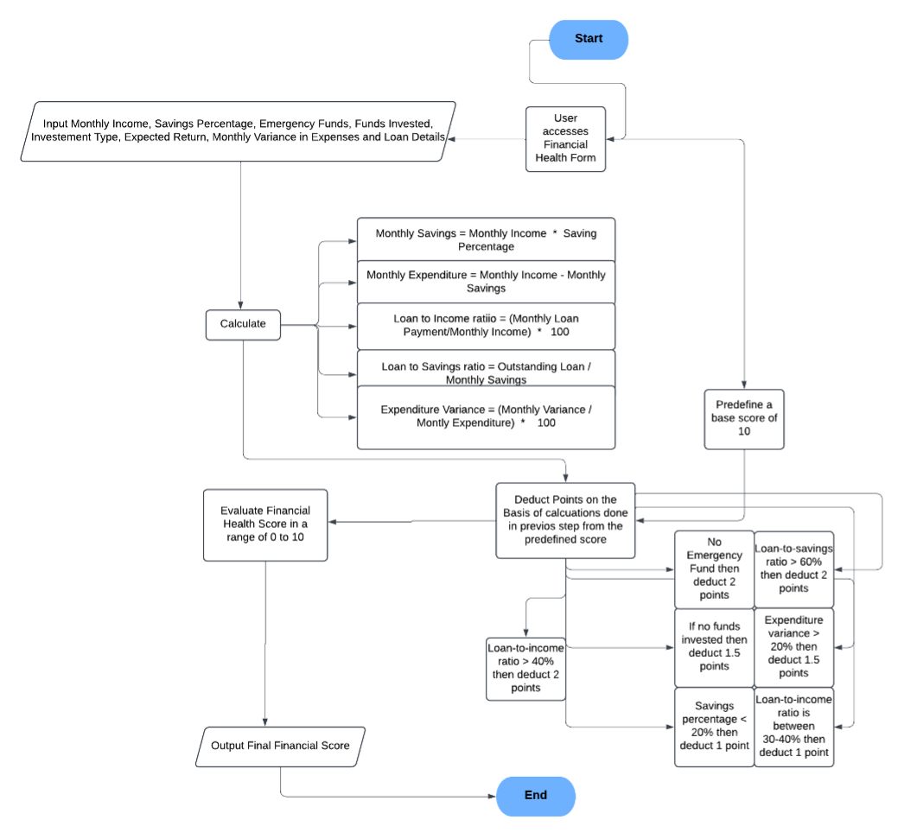

### Financial Health Assessment Web Application

This web application provides users with a personalized financial health assessment based on their income, savings, investments, loans, and expenditure patterns. It is built using Python Flask with CSV-based data storage, and includes features for tracking financial history, exporting reports, and visualizing financial health scores over time.

***

### Features

- Input form for monthly income, savings percentage, emergency fund status, investments, loans, and expenditure variance.
- Calculates a financial health score (0-10) based on multiple financial factors and country-specific economic data.
- Stores and retrieves user assessments with historical data.
- Provides detailed results with explanations adjusted for regional economic data.
- Export capability for individual assessments and full history in CSV format.
- History page displays past assessments with filtering and sorting options.
- Supports region-specific financial targets and currency settings.

***

### Technologies

- **Backend:** Python with Flask framework
- **Frontend:** HTML templates with Jinja2
- **Data Storage:** CSV files for users and assessments
- **Libraries:** pandas for data export, datetime, csv for CSV operations

***

### Setup Instructions

1. **Clone the repository** containing the Flask app and supporting files.

2. **Install dependencies:**
   ```bash
   pip install flask pandas
   ```

3. **Ensure supporting files are available:**

   - `regions.json`: Contains country-specific economic data and financial targets.
   - `users.csv` and `assessments.csv`: Will be created automatically on first run.

4. **Run the application:**
   ```bash
   python __main__.py
   ```

5. **Access the app** via `http://localhost:5000` in a web browser.

***

### Application Routes

- `/` - Financial Health Assessment Form (GET/POST)
- `/history` - View past financial assessments by the user
- `/assessment/{id}` - View details of a specific assessment
- `/export/csv/{id}` - Export a specific assessment report (CSV supported)
- `/export/history` - Export full assessment history CSV

***

### Scoring Logic Summary

The financial health score is determined by:

- Income relative to the national average.
- Status of emergency fund.
- Whether savings are invested or just held.
- Loan burden measured by loan-to-income and loan-to-savings ratios.
- Variance in monthly expenditure.
- Savings percentage relative to recommended targets.

Scores are adjusted by penalties and bonuses capped between 0 and 10.

***


## Summary Diagram



***

This documentation and flow visualization provide both technical and user-oriented understanding of how the financial health assessment application works, enabling smooth usage and maintenance.
