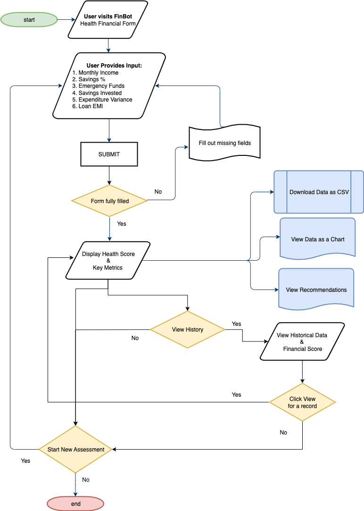
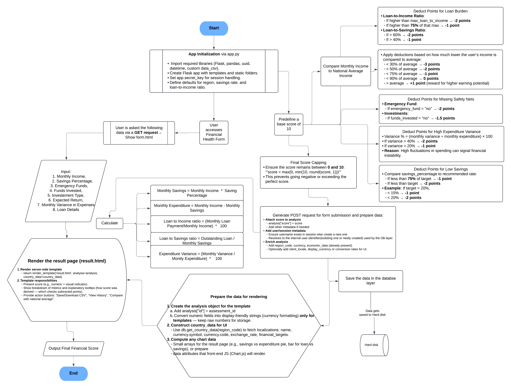

### Financial Health Assessment Web Application

This web application provides users with a personalized financial health assessment based on their income, savings, investments, loans, and expenditure patterns. It is built using Python Flask with CSV-based data storage, and includes features for tracking financial history, exporting reports, and visualizing financial health scores over time.

***

### Features

- Input form for monthly income, savings percentage, emergency fund status, investments, loans, and expenditure variance.
- Calculates a financial health score (0-10) based on multiple financial factors and country-specific economic data.
- Stores and retrieves user assessments with historical data.
- Provides detailed results with explanations adjusted for regional economic data.
- Export capability for individual assessments and full history in CSV format.
- History page displays past assessments with filtering and sorting options.
- Supports region-specific financial targets and currency settings.

***

### Technologies

- **Backend:** Python with Flask framework
- **Frontend:** HTML templates with Jinja2
- **Data Storage:** CSV files for users and assessments
- **Libraries:** Flask for Python

***

### Setup Instructions

1. **Clone the repository** containing the Flask app and supporting files.

2. **Install dependencies:**
   ```bash
   pip install -r requirements.txt
   ```

3. **Ensure supporting files are available:**

   - `regions.json`: Contains country-specific economic data and financial targets.
   - `users.csv` and `assessments.csv`: Will be created automatically on first run.

4. **Run the application:**
   ```bash
   python __main__.py
   ```

5. **Access the app** via `http://localhost:5000` in a web browser.

***

### Application Routes

- `/` - Financial Health Assessment Form (GET/POST)
- `/history` - View past financial assessments by the user
- `/assessment/{id}` - View details of a specific assessment
- `/export/csv/{id}` - Export a specific assessment report (CSV supported)
- `/export/history` - Export full assessment history CSV

***

### Scoring Logic Summary

The financial health score is determined by:

- Income relative to the national average.
- Status of emergency fund.
- Whether savings are invested or just held.
- Loan burden measured by loan-to-income and loan-to-savings ratios.
- Variance in monthly expenditure.
- Savings percentage relative to recommended targets.

Scores are adjusted by penalties and bonuses capped between 0 and 10.

***

## Summary Diagram



***

This documentation and flow visualization provide both technical and user-oriented understanding of how the financial health assessment application works, enabling smooth usage and maintenance.


## Program Flow Chart Description

Below is a description of the flow for the Financial Health Assessment application for user visualization:

1. **User Accesses Form (`/`)**
   - Inputs financial data including income, savings, investment, loans, and expenditure variance.

2. **Submit Form (POST)**
   - Data is collected and validated.
   - Country-specific economic and financial targets are fetched from `regions.json`.

3. **Financial Calculations**
   - Monthly savings and expenditures computed.
   - Loan-to-income and loan-to-savings ratios calculated.
   - Expenditure variance percentage determined.

4. **Score Calculation**
   - Factors including income relative to average, emergency fund, investments, loans, variance, and savings percentage weighted.
   - Final score capped between 0 and 10.

5. **Save Assessment**
   - User identified via session or created.
   - Assessment data saved in CSV storage.

6. **Render Results Page (`/result.html`)**
   - Shows score, economic context, recommendations, and detailed metrics.

7. **History and Reports**
   - Users can view previous assessments on `/history`.
   - Sort/filter options available.
   - Export individual reports or full history in CSV format.
   - View detailed assessment reports at `/assessment/`.


## User Documentation

### Purpose

This app helps individuals assess their financial health by analyzing key financial indicators including income, savings, loans, investments, and spending habits, contextualized by national economic data.

***

### How to Use

1. **Fill in Your Monthly Income** in local currency.

2. **Enter Your Savings Percentage** relative to your income. Aim for at least 20-30%.

3. **Confirm if Your Emergency Fund is Fully Provisioned** (recommended 3-6 months of expenses).

4. **Specify if Your Saved Funds Are Invested** and select the investment type (stocks, bonds, mutual funds, real estate, etc.).

5. **Enter Expected Annual Return** on investments.

6. **Report Monthly Variance** in your expenditures to reflect spending fluctuations.

7. **Declare Loan Details** if you have any loans:
   - Monthly loan payment
   - Outstanding loan amount

8. **Submit the Form** to receive your financial health score and personalized recommendations.

***

### Understanding Your Results

- **Financial Health Score (0-10):** Higher scores indicate better financial health.
- **Comparison to National Average:** Shows whether your income is above or below average.
- **Inflation Consideration:** Your savings growth should ideally keep pace with inflation to maintain purchasing power.
- **Recommendations:** Based on your score, tailored advice will be provided to improve your financial health.

***

### Additional Features

- **History Tracking:** View and compare your past assessments to see financial progress.
- **Export Functions:** Download reports of individual assessments or full history for personal records or financial planning.
- **Region Settings:** Automatically configured for your country to provide relevant benchmarks.

***

## Detailed Diagrammatic Representation



***